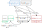

************
Architecture
************

The following figure shows the software stack required to deploy a SNMD environment:

   Software stack required by SNMD.

Data Aquision
=============

The *Data Aquision* layer collects data and publishes them to a MQTT message broker. The collected data can be in any (binary) format as long there is a approperiate widget library for SNMD to do the visualization.

nag2mqtt
--------
The nagios plugin `nag2mqtt <https://github.com/DE-IBH/nag2mqtt/>`_ can be used to publish nagios state and performance data to a MQTT message broker using JSON. SNMD ships with a corresponding widget library (*snmd-widgets-nagios*).

MQTT Message Broker
===================

A message broker is required to make the data of the DAQ layer available to the SNMD frontends. The broker needs to provide a web socket port since the frontend is a native HTML5 app. The usage of `Mosquitto <https://mosquitto.org/>`_ as MQTT broker is recommended.

Web Server
==========

A simple web server is required to serve static files:

* SNMD package
* config files (JSON)
* views (SVG)

Frontends
=========

Any HTML5 enabled browser should work (read: IE is not a (HTML5) browser). For 3D animation it's recommended to use a WebKit based one, the Gecko engine seems to have poor performance on CSS transformations.

Example of frontend devices:

* *Chromium 49+* on Desktop
* *Firefox 31+* on Desktop (3D not recommended)
* *Raspberry Pi* using *barkery* (*Raspbian Stretch* required)

barkery
-------

*Barkery* is a small perl script using GTK and WebKit to implement a kiosk browser window in full screen. The package can be easily installed on any recent Debian based distribution using systemd. On system boot *barkery* will be auto started and it works with read-only filesystems.

This is the prefered frontend if using a *Rasperry Pi*. To be able to manage a large number of frontends *barkery* is remote controlable via MQTT.
