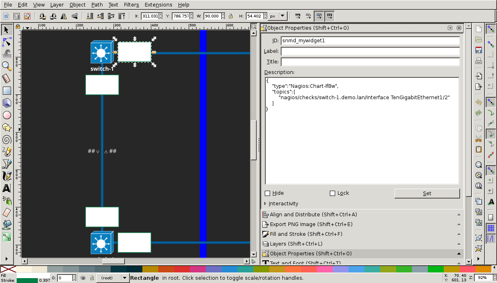
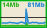
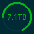
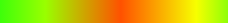
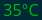
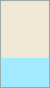

***************
Views & Widgets
***************

The visualization of SNMD is based on SVG files. It is highly recommended to use `Inkscape <https://inkscape.org/>`_ to create those SVG files.

.. hint::
    SNMD's color scheme is based on the `SOLARIZED <http://ethanschoonover.com/solarized>`_ palette of `Ethan Schoonover <https://github.com/altercation>`_.
    SNMD provides a GIMP palette file which can be used with Inkscape. Put the `snmd.gpl <_static/snmd.gpl>`_ into `~/.config/inkscape/palettes/` and after
    (re)starting *Inkscape* you are able to select the new palette *Solarized & SNMD Dark*.

A view is a common SVG file. When the SVG file is loaded by SNMD it will replace any SVG element matching the special ID pattern by a corresponding SNMD *widget*. SNMD widgets
may replace the original SVG elements completly, change their style, do some CSS transformations or replace their text content. Widgets are provided by widget libraries and based
on one of the basic widget implementations:

Widget Usage
============

Any SVG element where the ID begins with the string :code:`snmd_` will be treated as a SNMD widget. The behavior of a widget is configured using a :code:`desc` child element.

This is an example widget which will plot the interface bandwidth monitored by Nagios. The escaping of quotes has been removed to improve readability:

.. code-block:: xml
    :caption: *example widget configuration*

    <rect
     id="snmd_mywidget1"
     y="..."
     x="..."
     height="..."
     width="..."
     style="...">
    <desc>
        {
            "type":"Nagios:Chart-IfBw",
            "topics":[
                "nagios/checks/switch-1.demo.lan/Interface TenGigabitEthernet1/1"
            ]
        }
    </desc>
    </rect>

.. hint::
    Remember that the text content of the :code:`dect` element is interpreted as JSON. The JSON syntax does **not** allow a comma after the last element within arrays or objects.
    SNMD will not be able to use the widget if there is an JSON syntax error. Use your browser's debugging console to check for parsing errors if widgets do not work as expected.

The *Object Properties* editor of *Inkscape* is the prefered way to set the SVG element ID and edit the :code:`desc` element.

    *Object Properties* editor

Widgets Implementations
=======================

This is the list of available widget implementations. They can't be used directly but all widgets provided by *widget libraries* do use them. Some of the implementations
have common configuration options to change their layout or behavior.

All widget do support the following configuration options:

    **type**

        *(required)* This defines the widget type to be used. The value is the concatination of the widget library names space, a literal colon and the name of the widget class.

.. code:: none

            Nagios:Chart-IfBw

    **bcls**

        *(optional)* An array of additional CSS base classes of this widget for :ref:`customize-style`.

    **scls**

        *(optional)* An array of additional CSS state classes of this widget for :ref:`customize-style`.

Chart
-----

- **SVG Element:** *replaced*

    *Chart* widget plotting interface bandwidth usage over time

*Chart* widgets are used to plot time series monitoring data.

Class
-----

- **SVG Element:** *kept*

*Class* widgets get CSS classes applied depending on monitoring states.

Gauge
-----

- **SVG Element:** *replaced*

    *Gauge* widget (arc) showing storage allocation

*Gauge* widgets will show a radial gauge for a monitored value.

Gradient
--------

- **SVG Element:** *replaced*

    *Gradient* widget showing cabinet temperatur distribution

*Gradient* widgets will show a *linear* gradient where the gradient stops are replaced by monitoring values.
The monitoring values are mapped to a color using HSL a like coloring scheme.

RadialGradient
--------------

- **SVG Element:** *replaced*

*RadialGradient* widgets are simular to *Gradient* widgets but use a radial gradient.

StrokeWidth
-----------

- **SVG Element:** *kept*

*StrokeWidth* widgets will clear the SVG element's stroke property and replace it by the current monitoring value.

Text
----

- **SVG Element:** *kept*

    *Text* widget showing current temperature

*Text* widgets will replace the SVG element's text content by the monitoring value.

Transform
---------

- **SVG Element:** *kept*

    *Transform* widget (light blue rectangle) used as linear gauge

*Transform* widgets will apply CSS transformations depending on monitoring values.

.. hint::
    SNMD is view in dark mode (default) and can be switched to light mode. Although SNMD uses CSS variables which can be easely redefined to switch between
    *Solarized Dark* and *Solarized Light* colors it is not possible to use them for the SVG files since *Inkscape* does not support to use CSS variables(, yet).
